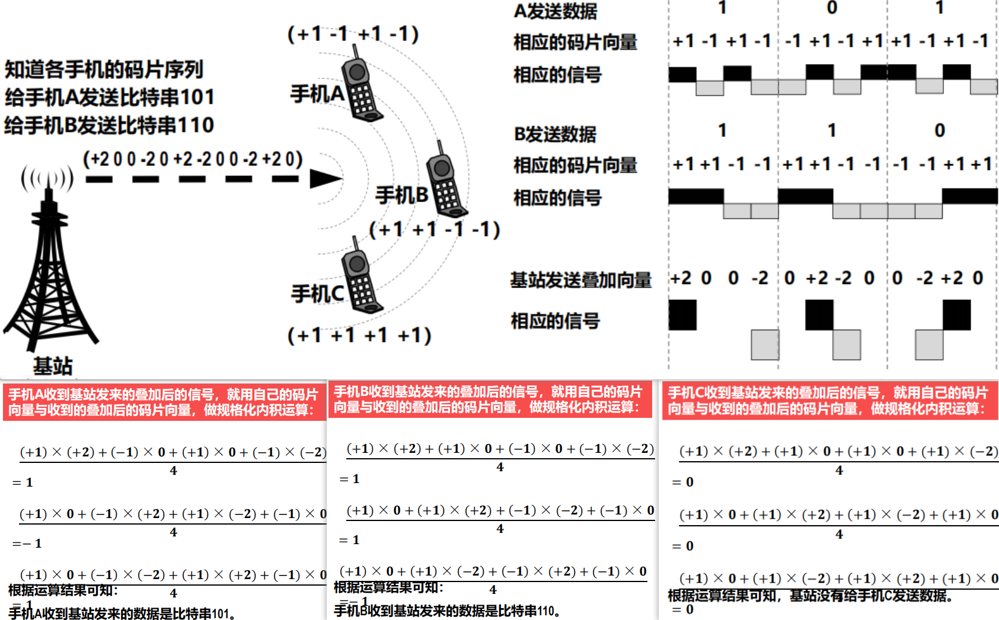

# chapter 2 Physical layers
<!-- TOC -->

- [1. 物理层概述](#1-物理层概述)
	- [1.1. 物理层要实现的功能](#11-物理层要实现的功能)
	- [1.2. 物理层的接口特性](#12-物理层的接口特性)
		- [1.2.1. 机械特性](#121-机械特性)
		- [1.2.2. 电气特性](#122-电气特性)
		- [1.2.3. 功能特性](#123-功能特性)
		- [1.2.4. 过程特性](#124-过程特性)
- [2. 物理层下面的传输媒体](#2-物理层下面的传输媒体)
	- [2.1. 传输媒体的分类](#21-传输媒体的分类)
	- [2.2. 导向型传输媒体](#22-导向型传输媒体)
		- [2.2.1. 同轴电缆](#221-同轴电缆)
			- [2.2.1.1. 基带同轴电缆（50Ω）](#2211-基带同轴电缆50ω)
			- [2.2.1.2. 宽带同轴电缆（75Ω）](#2212-宽带同轴电缆75ω)
		- [2.2.2. 双绞线](#222-双绞线)
		- [2.2.3. 光纤](#223-光纤)
			- [2.2.3.1. 多模光纤](#2231-多模光纤)
			- [2.2.3.2. 单模光纤](#2232-单模光纤)
	- [2.3. 非导向型传输媒体](#23-非导向型传输媒体)
		- [2.3.1. 无线电波](#231-无线电波)
			- [2.3.1.1. 中低频](#2311-中低频)
			- [2.3.1.2. 高频甚高频](#2312-高频甚高频)
		- [2.3.2. 微波](#232-微波)
			- [2.3.2.1. 地面微波接力通信](#2321-地面微波接力通信)
			- [2.3.2.2. 卫星通信](#2322-卫星通信)
		- [2.3.3. 红外线](#233-红外线)
		- [2.3.4. 激光](#234-激光)
			- [2.3.4.1. 大气激光通信](#2341-大气激光通信)
			- [2.3.4.2. 光纤通信](#2342-光纤通信)
		- [2.3.5. 可见光](#235-可见光)
- [3. 传输方式](#3-传输方式)
	- [3.1. 串行传输和并行传输](#31-串行传输和并行传输)
		- [3.1.1. 串行传输](#311-串行传输)
		- [3.1.2. 并行传输](#312-并行传输)
	- [3.2. 同步传输和异步传输](#32-同步传输和异步传输)
		- [3.2.1. 同步传输](#321-同步传输)
		- [3.2.2. 异步传输](#322-异步传输)
	- [3.3. 单向通信、双向交替通信和双向同时通信](#33-单向通信双向交替通信和双向同时通信)
- [4. 编码与调制](#4-编码与调制)
	- [4.1. 编码与调制的基本概念](#41-编码与调制的基本概念)
		- [4.1.1. 调制](#411-调制)
		- [4.1.2. 码元](#412-码元)
	- [4.2. 常用编码方式](#42-常用编码方式)
		- [4.2.1. 双极性不归零编码](#421-双极性不归零编码)
		- [4.2.2. 双极性归零编码](#422-双极性归零编码)
		- [4.2.3. 曼彻斯特编码](#423-曼彻斯特编码)
		- [4.2.4. 差分曼彻斯特编码](#424-差分曼彻斯特编码)
	- [4.3. 基本的带通调制方法和混合调制方法](#43-基本的带通调制方法和混合调制方法)
		- [4.3.1. 基本的带通调制方法](#431-基本的带通调制方法)
		- [4.3.2. 混合调制方法](#432-混合调制方法)
			- [4.3.2.1. 正交振幅调制QAM-16](#4321-正交振幅调制qam-16)
- [5. 信道的极限容量](#5-信道的极限容量)
	- [5.1. 造成信号失真的主要因素](#51-造成信号失真的主要因素)
		- [5.1.1. 码元的传输速率](#511-码元的传输速率)
		- [5.1.2. 信号的传输距离](#512-信号的传输距离)
		- [5.1.3. 噪声干扰](#513-噪声干扰)
		- [5.1.4. 传输媒体的质量](#514-传输媒体的质量)
	- [5.2. 奈氏准则](#52-奈氏准则)
	- [5.3. 香农公式](#53-香农公式)
- [6. 信道复用技术](#6-信道复用技术)
	- [6.1. 信道复用技术的基本原理](#61-信道复用技术的基本原理)
	- [6.2. 常见的信道复用技术](#62-常见的信道复用技术)
		- [6.2.1. 频分复用FDM](#621-频分复用fdm)
		- [6.2.2. 时分复用TDM](#622-时分复用tdm)
		- [6.2.3. 波分复用WDM](#623-波分复用wdm)
		- [6.2.4. 码分复用CDM](#624-码分复用cdm)
- [7. 题目](#7-题目)

<!-- /TOC -->
## 1. 物理层概述

### 1.1. 物理层要实现的功能
- “透明”传输比特流
- 数据链路层只管“享受”物理层提供的比特流传输服务，不需知道其具体传输方法
### 1.2. 物理层的接口特性
#### 1.2.1. 机械特性
- 形状和尺寸
- 引脚数目和排列
- 固定和锁定装置
#### 1.2.2. 电气特性
- 信号电压的范围
- 阻抗匹配的情况
- 传输速率
- 距离限制
#### 1.2.3. 功能特性
- 规定接口电缆的各条信号线的作用
#### 1.2.4. 过程特性
- 规定在信号线上传输比特流的一组操作过程，包括各信号间的时序关系
## 2. 物理层下面的传输媒体

### 2.1. 传输媒体的分类
- 传输媒体是计算机网络设备之间的物理通路，也称为传输介质或传输媒介
- 传输媒体并**不包含在计算机网络体系结构中**

```mermaid
graph LR
传输媒体 --- 导向型传输媒体/固体媒体
导向型传输媒体/固体媒体 --- 同轴电缆
导向型传输媒体/固体媒体 --- 双绞线 
导向型传输媒体/固体媒体 --- 光纤
传输媒体 --- 非导向型传输媒体/自由空间
非导向型传输媒体/自由空间 --- 无线电波
非导向型传输媒体/自由空间 --- 微波
非导向型传输媒体/自由空间 --- 红外线
非导向型传输媒体/自由空间 --- 大气激光
非导向型传输媒体/自由空间 --- 可见光
```
### 2.2. 导向型传输媒体
#### 2.2.1. 同轴电缆
- 价格较贵且布线不够灵活和方便
##### 2.2.1.1. 基带同轴电缆（50Ω）
- 用于数字传输，在早期局域网中广泛使用
##### 2.2.1.2. 宽带同轴电缆（75Ω）
- 用于模拟传输，目前主要用于有线电视的入户线。
#### 2.2.2. 双绞线 
- 局域网领域基本上都采用双绞线作为传输媒体

- 绞合的作用
	- 减少相邻导线间的电磁干扰
	- 抵御部分来自外界的电磁干扰
#### 2.2.3. 光纤

- 光纤通信系统的传输带宽远大于目前其他各种传输媒体的带宽
- 优点
    - 通信容量非常大
    - 抗雷电和电磁干扰性能好
    - 传输损耗小，中继距离长
    - 无串音干扰，保密性好
    - 体积小，重量轻
- 缺点
    - 切割光纤需要较贵的专用设备
	- 目前光电接口还比较昂贵

##### 2.2.3.1. 多模光纤

- 多条光波在多模光纤中不断地全反射
- 只适合于建筑物内的近距离传输

##### 2.2.3.2. 单模光纤

- 光在单模光纤中一直向前传播
- 适合长距离传输且衰减更小

### 2.3. 非导向型传输媒体

#### 2.3.1. 无线电波

##### 2.3.1.1. 中低频

##### 2.3.1.2. 高频甚高频

#### 2.3.2. 微波

##### 2.3.2.1. 地面微波接力通信

##### 2.3.2.2. 卫星通信

-   三颗同步卫星
-   中低轨道同步卫星

#### 2.3.3. 红外线

- 点对点无线传输
- 直线传输，中间不能有障碍物，传输距离短
- 传输速率低（4Mb/s ~ 16Mb/s）

#### 2.3.4. 激光

##### 2.3.4.1. 大气激光通信

- 优点
	- 通信容量大
	- 保密性强
	- 结构轻便
	- 设备经济
- 缺点
	- 通信距离受限于视距
	- 易受气候影响
	- 瞄准困难

##### 2.3.4.2. 光纤通信

#### 2.3.5. 可见光

- LIFI可见光通信

## 3. 传输方式

### 3.1. 串行传输和并行传输

- 网络同时具有串行传输和并行传输（并串转换、串并转换）

#### 3.1.1. 串行传输
- 用于远距离传输

#### 3.1.2. 并行传输
- 用于短距离传输

### 3.2. 同步传输和异步传输

#### 3.2.1. 同步传输
- 收发双方时钟同步的方法
	- 外同步：在收发双方之间增加一条时钟信号线。
	- 内同步：发送端将时钟信号编码到发送数据中一起发送（例如曼彻斯特编码）。

#### 3.2.2. 异步传输

- 字节之间异步，即字节之间的时间间隔不固定。
- 字节中的每个比特仍然要同步，即各比特的持续时间是相同的。

### 3.3. 单向通信、双向交替通信和双向同时通信

- 单向通信（单工）：无线电广播
- 双向交替通信（半双工）：不能同时、如对讲机
- 双向同时通信（全双工）：可同时、如手机

## 4. 编码与调制

### 4.1. 编码与调制的基本概念

#### 4.1.1. 调制

- 基带调制（编码）：数字信道
	- 以太网采用的曼彻斯特编码、4B/5B、8B/10B
- 带通调制：模拟信道
	- Wi-Fi采用的CCK/DSSS/OFDM调制

#### 4.1.2. 码元
- 在使用时间域的波形表示信号时，代表不同离散数值的基本波形称为码元

### 4.2. 常用编码方式

#### 4.2.1. 双极性不归零编码
- 编码效率高，但存在同步问题

#### 4.2.2. 双极性归零编码
- 自同步，但编码效率低
- 码元中间时刻的电平跳变既表示时钟信号，也表示数据。 
- 正跳变表示1还是0，负跳变表示0还是1，可以自行定义。

#### 4.2.3. 曼彻斯特编码
- 自同步，10Mb/s传统以太网

#### 4.2.4. 差分曼彻斯特编码
- 码元中间时刻的电平跳变仅表示时钟信号，而不表示数据。
- 数据的表示在于每一个码元开始处是否有电平跳变：无跳变表示1，有跳变表示0。

### 4.3. 基本的带通调制方法和混合调制方法

#### 4.3.1. 基本的带通调制方法

-   调幅（AM）、调频（FM）、调相（PM）

#### 4.3.2. 混合调制方法

- 频率和相位不能进行混合调制（频率是相位随时间的变化率）
- 通常情况下，载波的相位和振幅可以结合起来一起调制，例如**正交振幅调制QAM。**

##### 4.3.2.1. 正交振幅调制QAM-16

-   12种相位
-   每种相位有1或2种振幅可选
-   可以调制出16种码元（波形），每种码元可以对应表示4个比特（log216=4）
-   每个码元与4个比特的对应关系采用格雷码，即任意两个相邻码元只有1个比特不同

## 5. 信道的极限容量

### 5.1. 造成信号失真的主要因素

- 信道上传输的数字信号，可以看做是多个频率的模拟信号进行多次叠加后形成的方波。
- 码间串扰
	- 接收端接收到的信号波形失去了码元之间的清晰界限
	- 信道的频带越宽，则能够通过的信号的高频分量就越多，那么码元的传输速率就可以更高，而不会导致码间串扰。
- 信道的频率带宽是有上限的 --> 码元的传输速率也有上限

#### 5.1.1. 码元的传输速率
- 越高越严重

#### 5.1.2. 信号的传输距离
- 越远越严重

#### 5.1.3. 噪声干扰
- 越大越严重

#### 5.1.4. 传输媒体的质量
- 越差越严重

### 5.2. 奈氏准则

$$
理想低通信道的最高码元传输速率 = 2 \textbf{W Baud} \\

\textbf{W}：信道的频率带宽（单位为Hz） \\

\textbf{Baud}：波特，即码元/秒 = 2 \ \textbf{W} \  码元/秒
$$

- 一个实际的信道所能传输的最高码元传输速率，要明显低于奈氏准则给出的上限值
- 码元传输速率又称为波特率、调制速率、波形速率或符号速率

### 5.3. 香农公式

$$
C=Wlog_{2}(1+\frac{S}{N}) \\
$$

- 带宽受限且有高斯白噪声干扰的信道的极限信息传输速率

$$
C: 信道的极限信息传输速率（单位为b/s）\\
W: 信道的频率带宽（单位为Hz）\\
S: 信道内所传信号的平均功率\\ 
N: 信道内的高斯噪声功率\\
\frac{S}{N}: 信噪比，使用分贝（dB）作为度量单位\\
\ \ \ 信噪比(db)=10log_{10}(\frac{S}{N})(db)
$$

## 6. 信道复用技术

### 6.1. 信道复用技术的基本原理

- 复用（Multiplexing）就是在一条传输媒体上同时传输多路用户的信号。
- 当一条传输媒体的传输容量大于多条信道传输的总容量时，就可以通过复用技术，在这条传输媒体上建立多条通信信道，以便充分利用传输媒体的带宽。

### 6.2. 常见的信道复用技术

#### 6.2.1. 频分复用FDM

- 频分复用的所有用户同时占用不同的频带资源并行通信

#### 6.2.2. 时分复用TDM

- 时分复用的所有用户在不同的时间占用同样的频带

#### 6.2.3. 波分复用WDM

- 根据频分复用的设计思想，可在一根光纤上同时传输多个频率（波长）相近的光载波信号，实现基于光纤的频分复用技术。
- 目前可以在一根光纤上复用80路或更多路的光载波信号。因此，这种复用技术也称为密集波分复用DWDM。

#### 6.2.4. 码分复用CDM

- 码分复用（Code Division Multiplexing，CDM）常称为码分多址（Code Division Multiple Access，CDMA），它是在扩频通信技术的基础上发展起来的一种无线通信技术。
- 与FDM和TDM不同，CDMA的每个用户可以在相同的时间使用相同的频带进行通信。
- 码片（Chip）
  - CDMA将每个比特时间划分为m个更短的时间片
  - m的取值通常为64或128
- m比特码片序列（Chip Sequence）
  - 某个站要发送比特1，则发送它自己的m比特码片序列
  - 某个站要发送比特0，则发送它自己的m比特码片序列的反码
- 码片向量
  - 将码片序列中的比特0记为-1，而比特1记为+1
- 码片序列规则
  - 每个站的码片序列必须各不相同，实际常采用伪随机码序列。
  - 每个站的码片序列必须相互正交，即各码片序列相应的码片向量之间的规格化內积为0。

令向量A表示站A的码片向量，向量B表示站B的码片向量，则

$$
A \cdot B = \frac{1}{m} \sum_{i=1}^m A_{i}B{i} = 0
$$

## 7. 题目

